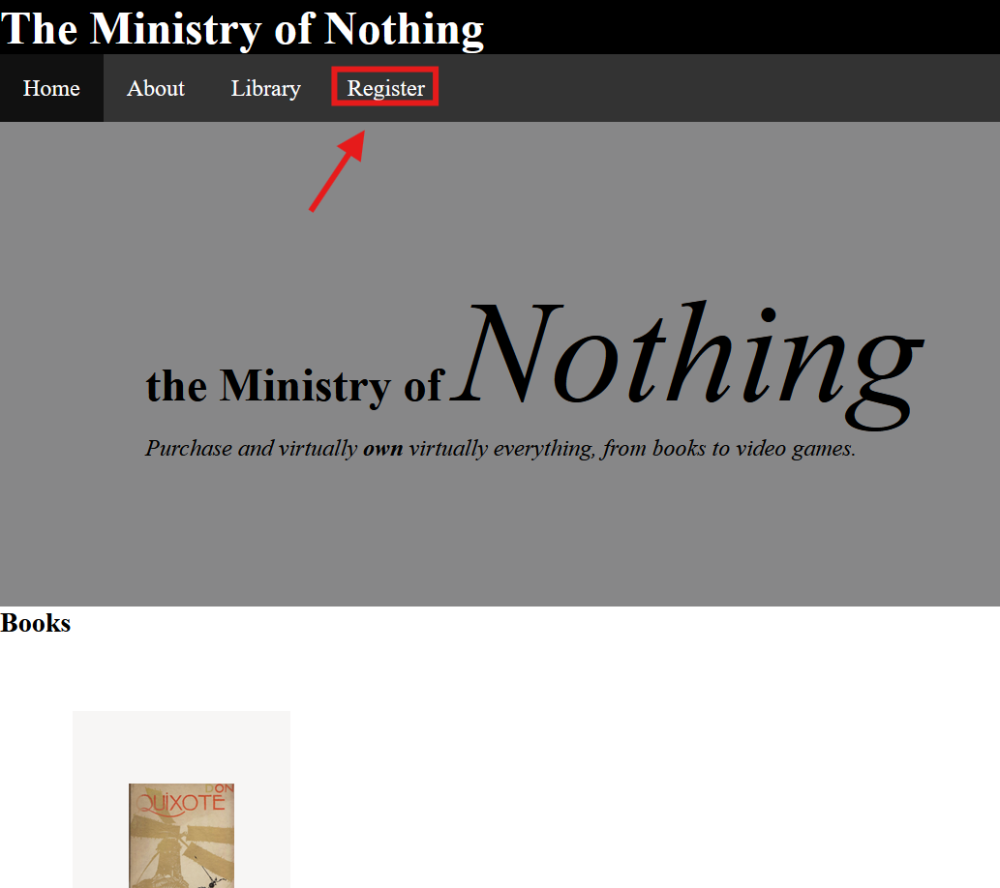
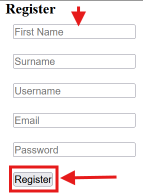

# Brukerveiledning — The Ministry of Nothing

Nettsiden er laget for å simulere online shopping. Først kommer man inn på forsiden, men først bør du lage en bruker. Derfor må du gå til "register"-siden:

Og så skrive inn navn, etternavn, brukernavn og epost (passord er ikke implementert):

Trykk så på knappen "register". Nå kan du gå til forsiden igjen og trykke "kjøp"-knappen på det du vil ha (har ikke kodet ferdig eller lagt til knapp enda). Da kommer disse items til å være i _owned_-tabellen og koblet til din bruker (har ikke session enda, men slik vil den vite at det er deg).
