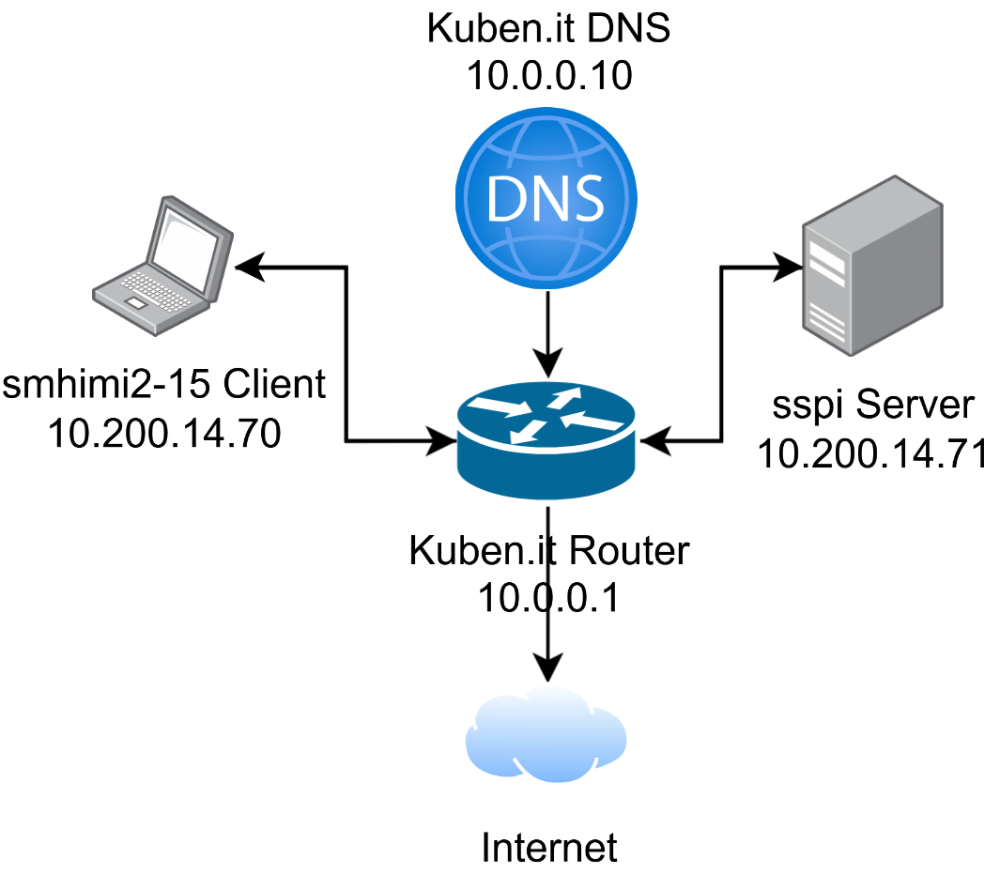

# Flask-prosjekt "The Ministry of Nothing" — Dokumentasjon

## 1. Forside

**Prosjekttittel:** The Ministry of Nothing

**Navn:** Sivert Mathisen Hansen

**Klasse:** 2IMI

**Dato startet:** 10. november 2025

**Kort beskrivelse av prosjektet:**

Jeg har lyst til å lage en slags nettbutikk for kulturmedia. Den lar deg kjøpe musikk, filmer, serier, bøker og spill (ikke online-spill). Målgruppen til denne nettsiden vil være de som liker kulturmedia og de som vil eie ting selv. Du kan gå inn på din egen bruker og få en oversikt over det du eier, sortert etter type media. Dette kan da lastes ned lokalt (imaginær funksjonalitet).

---

## 2. Systembeskrivelse

**Formål med applikasjonen:**

Formålet er å vise kompetanse innenfor temaet databaser, python og sql. Prosjektet har stor telling på karakteren dette skoleåret.

**Brukerflyt:**

Startsiden er en velkomstside og tilbyr online shopping av de forskjellige mediumene. Her kan du kjøpe ting (ingen faktisk betaling), deretter eier du de. En av lenkene på navbaren leder til brukersiden din, og du får en oversikt av eiendeler, sortert etter ulike kategorier (film, spill, bok, osv.).

Dette gjelder bare hvis du har en bruker allerede. Hvis du ikke har bruker kan du gå til "/u/register" (på navbar: Register) på nettsiden og fylle ut skjemaet som lager en.

**Teknologier brukt:**

- Python / Flask
- MariaDB
- HTML / CSS / JS

---

## 3. Server-, infrastruktur- og nettverksoppsett

### Servermiljø

Vi har en Raspberry Pi 4 vi har fått av skolen og bruker den som fysisk server. På den var Raspberry Pi OS 64-bit Lite installert.

### Nettverksoppsett

- **Nettverksdiagram:**



- **IP-adresser:** 10.200.14.71 (rpi, statisk), 10.200.14.70 (sihaawc, statisk)
- **IP-addresser (hjemme):** 192.168.68.134 (rpi, statisk), 192.168.68.131 (sihaawc-home, statisk)
- **Porter:** 22 (ssh)
- **Brannmurregler:** ufw allow 22

Eksempel:

    Klient → Waitress → MariaDB

### Tjenestekonfigurasjon

- **systemctl / Supervisor:**
- **Filrettigheter:**
- **Miljøvariabler:** DB_HOST, DB_USER, DB_PASSORD, DB_NAME, DB_HOST_HOME, DB_USER_HOME, DB_PASSORD_HOME

- **Databasebruker:**

```sql
# koden er skrevet i forhold til hjemmeoppsettet mitt.

CREATE USER 'sihaawc-home'@'192.168.68.131 eller %' IDENTIFIED BY 'sett_inn_passord';

GRANT ALL PRIVILEGES ON *.* TO 'sihaawc-home'@'192.168.68.131 eller %';

FLUSH PRIVILEGES;
```

eller, hvis IP-adresse har endret seg p.g.a. DHCP:

``RENAME USER 'gammeltnavn'@'ip1' TO 'nyttnavn'@'ip2'``

---

## 4. Prosjektstyring -- GitHub Projects (Kanban)

- To Do / In Progress / Done
- Issues
- Skjermbilde (valgfritt)

**Hvordan hjalp Kanban arbeidet?**

Jeg har ikke vært vant til å bruke noe slikt før, men det var veldig hjelpsomt. Kanban erstatter det vi gjorde før, altså å skrive ned mål for neste time i loggen. Nå har jeg en enkel oversikt som jeg ikke må skrive om igjen, og det bare fordi jeg ikke ble helt ferdig den dagen. Når du har skrevet inn et issue, kan du bare flytte den rundt på tavlen. Du ser også hva du har gjort. Det var motiverende å se akkurat det på en dårlig dag.

---

## 5. Databasebeskrivelse

**Databasenavn:** nothing_ministry

**Tabeller:**

```sql
# SHOW TABLES;
+----------------------------+
| Tables_in_nothing_ministry |
+----------------------------+
| category                   |
| creator                    |
| item                       |
| owned                      |
| user                       |
+----------------------------+

# struktur av tabeller
# DESC user;
+----------+--------------+------+-----+---------+----------------+
| Field    | Type         | Null | Key | Default | Extra          |
+----------+--------------+------+-----+---------+----------------+
| id       | int(11)      | NO   | PRI | NULL    | auto_increment |
| name     | varchar(255) | NO   |     | NULL    |                |
| surname  | varchar(255) | NO   |     | NULL    |                |
| username | varchar(255) | NO   | UNI | NULL    |                |
| email    | varchar(255) | NO   |     | NULL    |                |
+----------+--------------+------+-----+---------+----------------+

# DESC owned;
+--------------+-----------+------+-----+---------------------+----------------+
| Field        | Type      | Null | Key | Default             | Extra          |
+--------------+-----------+------+-----+---------------------+----------------+
| id           | int(11)   | NO   | PRI | NULL                | auto_increment |
| date_ordered | timestamp | YES  |     | current_timestamp() |                |
| user_id      | int(11)   | YES  | MUL | NULL                |                |
| item_id      | int(11)   | YES  | MUL | NULL                |                |
+--------------+-----------+------+-----+---------------------+----------------+

# DESC item;
+-------------+--------------+------+-----+---------+----------------+
| Field       | Type         | Null | Key | Default | Extra          |
+-------------+--------------+------+-----+---------+----------------+
| id          | int(11)      | NO   | PRI | NULL    | auto_increment |
| name        | varchar(255) | NO   |     | NULL    |                |
| creator_id  | int(11)      | YES  | MUL | NULL    |                |
| category_id | int(11)      | YES  | MUL | NULL    |                |
+-------------+--------------+------+-----+---------+----------------+

# DESC creator;
+-------------+--------------+------+-----+---------+----------------+
| Field       | Type         | Null | Key | Default | Extra          |
+-------------+--------------+------+-----+---------+----------------+
| id          | int(11)      | NO   | PRI | NULL    | auto_increment |
| name        | varchar(255) | NO   |     | NULL    |                |
| category_id | int(11)      | YES  | MUL | NULL    |                |
+-------------+--------------+------+-----+---------+----------------+

# DESC category;
+-------+--------------+------+-----+---------+----------------+
| Field | Type         | Null | Key | Default | Extra          |
+-------+--------------+------+-----+---------+----------------+
| id    | int(11)      | NO   | PRI | NULL    | auto_increment |
| name  | varchar(255) | NO   |     | NULL    |                |
+-------+--------------+------+-----+---------+----------------+
```

**SQL-eksempel:**

Denne koden lager brukertabellen:

```sql
# backticks på "user" fordi den brukes allerede i sql-kode
CREATE TABLE `user` (
    id INT AUTO_INCREMENT PRIMARY KEY,
    name VARCHAR(255) NOT NULL,
    surname VARCHAR(255) NOT NULL,
    username VARCHAR(255) NOT NULL UNIQUE,
    email VARCHAR(255) NOT NULL
);
```

Koden under setter inn id til bruker og gjenstand, slik at de "eier" gjenstanden.

```sql
INSERT INTO owned (user_id, item_id) VALUES (1, 1);
```


```sql
mysqldump -u sivert -p nothing_ministry > nothing_ministry.sql
```

---

## 6. Programstruktur

    nothing_ministry_2imi2025/
     ├── app.py
     ├── templates/
     |     ├──index.html
     |     ├──register.html
     |     ├──about.html   
     |     └──user.html
     |
     ├── python/
     |     └──functions.py
     |
     ├── static/
     |     ├──media/
     |     └──stylesheets/
     |          └──style.css
     |
     ├── docs/
     |     ├──nothingministry_networkmap.png
     |     ├──nothing_ministry.sql
     |     └──readme.md
     |
     └── .env

Databasestrøm:

    HTML → Flask → MariaDB → Flask → HTML-tabell

---

## 7. Kodeforklaring

Under er koden for en dynamisk brukerside.

```python
# varierende brukerside
@app.route("/u/<string:username>")
def show_user(username):
    mydb = get_connection()
    mycursor = mydb.cursor()

    # Henter brukernavn og id basert på brukernavn i url
    mycursor.execute("SELECT id, username FROM user WHERE username = %s", (username,))
    row = mycursor.fetchone()

    if row:
        user_id, username = row
        # henter "items" fra gjeldene bruker
        mycursor.execute("SELECT * FROM owned WHERE user_id = %s", (user_id,))
        items = mycursor.fetchall()
    else:
        username = "User not found"
        items = []

    mydb.close()

    return render_template("user.html", username=username, item=items)
```

Forklaring:

1. Den kjører en sql-query mot databasen for å hente ut brukernavn og passord.

2. Bruker If-setning til å bare hente "items" bruker eier.

---

## 8. Sikkerhet og pålitelighet

- .env
- Miljøvariabler for db-passord, db-brukernavn, o.l.
- Parameteriserte spørringer med %s ved queries
- Validering
- Feilhåndtering i python med try except

---

## 9. Feilsøking og testing

- Typiske feil
- Hvordan du løste dem
- Testmetoder

### Testing

Sletter alle tabeller slik at jeg kan starte fra null. Dette er fint hvis jeg endrer på strukturen i python-koden. Rekkefølgen er viktig, ellers får du error med foreign key:

```sql
DROP TABLE IF EXISTS owned, item, creator, category, user;
```

Når jeg hadde feil rekkefølge fikk jeg denne feilen:
ERROR 1451 (23000): Cannot delete or update a parent row: a foreign key constraint fails

### Feil Jeg Fikk

**Definering av tabeller på feil måte:**

- Feil rekkefølge slik at tabeller med FK blir laget før den den refererer til.

- Ikke kall en tabell for _order_, for det ser ut til å være en sql-kommando og førte til at tabell ikke ble laget. Jeg kalte den _receipt_ istdeden.

**SSH til pi stoppet å funke:**

- Jeg fikk feilen _"permission denied (public key)"_, for pi-en hadde blitt plutselig satt til å bare bruke ssh-key og ingen passord. Jeg fikset feilen ved å gå til filen _/etc/ssh/sshd_config_ og endre linjen _PasswordAuthentication_ til _yes_, det sto _no_ for meg.

**Kunne ikke pinge eller koble til Pi:**

- Viste seg å være et brannmurproblem. Dette hjalp:

```bash
sudo ufw allow from any to any proto
sudo ufw reload
```

- Dette åpner _proto_ i brannmuren, noe som fikset problemet med ping og tilkobling.

---

## 10. Konklusjon og refleksjon

**Hva lærte du?**

- Hva fungerte bra?

Databasestrukturen synes jeg passet veldig godt til behovet mitt. 

- Hva ville du gjort annerledes?

Hvis jeg skulle gjort noe annerledes ville brukt % istedenfor én adresse (remote mariadb-bruker), det skapte én gang store tekniske problemer i forhold til at det var en amatøroppgave og ikke prosjekt egentlig trenger den sikkerheten. Man kan da bruke risikovurdering til å bestemme slike ting som dette.

- Hva var utfordrende?

Det som var mest utfordrende var å sette opp en god struktur av databasen og hente frem den informasjon til brukersiden på nettsiden. Det var mange Foreign Keys å tenke på, og hvilke rekkefølge man må lage og slette tabeller

---

## 11. Kildeliste

- w3schools
- flask.palletsprojects.com
- [ssh.com (host configuration)](https://www.ssh.com/academy/ssh/sshd_config)
- [geeksforgeeks.com (flask session)](https://www.geeksforgeeks.org/python/how-to-use-flask-session-in-python-flask/)
